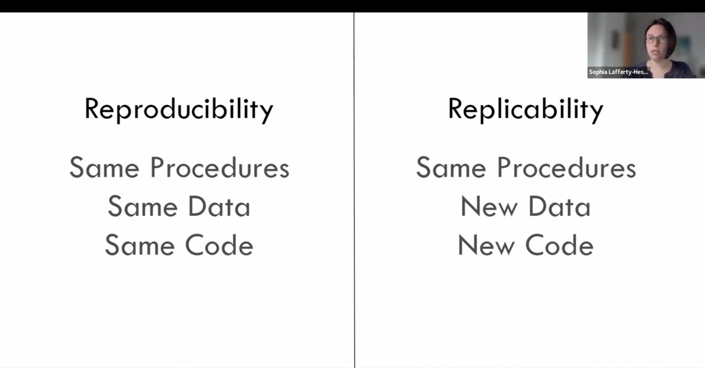

# Q1.

> Summarize new things you learned in this module about **reproducible data science** and **literate coding**

## Reproducible data science

One thing I learned from the video is the difference between reproducibility and replicability. As shown in @fig-two_definitions, reproducibility means using the same procedures, data, and code to get the same results. Replicability uses new data to test the same idea again.

{#fig-two_definitions fig-align="center"}

I also learned that good organization is very important for reproducibility. For example, we should keep raw data unchanged, separate data, code, and results into different folders, use clear file names, and document the project with things like a README file or codebook. These habits make it easier to understand and repeat the work later, especially if we return to the project a year later or even longer.

@fig-good_organization shows one way to organize analysis files for reproducibility. The example separates the project into four folders:

1.  ORIGINAL DATA

2.  DOCUMENTS

3.  ANALYSIS DATA

4.  COMMAND FILES

{#fig-good_organization fig-align="center"}

::: callout-note
# How About Using the Excel Spreadsheet?

The presenter mentioned that Excel spreadsheets do not have many reproducibility features. If we go back to an old Excel project after a long time, it can be hard to remember what steps we took to get the final results. Using scripts and keeping clear documentation makes the workflow much easier to follow later.
:::

## Literate Coding

I learned that literate coding means combining code, written explanations, and visualizations in the same document. Quarto is a good example because I can explain what I am doing, run the R code, and show the results together.

I also like that if the data changes, I can rerun the code and update the results instead of manually changing tables or graphs. This makes the whole process easier to follow and more reproducible. @fig-literate_coding shows how code and written explanations can be kept together.

{#fig-literate_coding fig-align="center"}

# Q2.

> Summarize the instructor's lecture about Quarto that you found impressive. Do you see yourself using Quarto every day for your job or study, like taking notes in your class or preparing a presentation? More eye-catching effects will be introduced in later modules.

| Quarto | Why? |
|------------------------------------|------------------------------------|
| Tables | Easy to create in Visual mode and useful for organizing information. |
| Citations | I can add citations using a DOI, and Quarto can create the reference list automatically. |
| Cross-references | Figures and tables can be numbered and linked automatically. |
| Callout blocks | Useful for adding notes, tips, cautions, or important information. |
| Coding folding | Keeps the page cleaner because readers can choose whether to show the code. |
| Themes | Makes the HTML report look more customized and professional. |

: Quarto features from Dr. Jung's lecture that stood out to me.[^1]

[^1]: This lecture was presented by Dr. Jae Jung and can be viewed here: [Module 2 Advanced Literate Programming with Quarto](https://jmjung.quarto.pub/m02-advanced-literate-programming/#theme-options).

This table summarizes some of the Quarto features that I found most useful. I especially liked citations, cross-references, callout blocks, code folding, and themes. These features can make a report easier to read and more organized. I also liked that Quarto can automatically create references and link figures, tables, and sections.

I haven't had a chance to use Quarto at work yet because I just started learning RStudio in class. However, I have been using it quite a lot in IBM 6500 and IBM 5910. In both classes, we use RStudio for R scripts, Markdown, and QMD files to complete assignments and in-class activities.

Dr. Jung suggested using Quarto often. I can see why because I am still slow with some features, but it is already getting easier as I use it more in class. For now, I mainly see Quarto as a useful tool for school. As I get more familiar with it, I could also see myself using it for future projects and eventually at work.

::: aside
I am also interested in learning how to insert a video and give it a proper citation in a QMD file in future tutorials.
:::

# Q3.

> Summarize the video presentation about reproducibility crisis. What do you think about reproducible crisis in your field? How can Quarto help address the concerns you have about reproducibility in the line of your work?

::: callout-note
## What is SPSS?

SPSS stands for Statistical Package for the Social Sciences. It is software commonly used to manage and analyze quantitative data.
:::

The reproducibility crisis refers to situations where researchers may not be able to get the same results again even when using the same data and analysis process. One example from the video was manually copying results from SPSS into Excel, Word, or PowerPoint. This can create mistakes. After several years, it may also be difficult to remember exactly how the results were produced.

I think this can also be a problem in digital marketing. We often work with data from different sources such as website analytics, social media, and advertising platforms. If someone manually changes the data without keeping a clear record, it may be difficult for me or another team member to repeat the same analysis later. Quarto can help because I can keep my writing, code, results, and visualizations together. If the data changes, I can rerun the code and update the results instead of copying everything manually again.

# Q4.

> Summarize what you learned in this module about the Tidyverse ecosystem in R. What can you do with R?

I learned that Tidyverse is a collection of R packages that work together for data analysis. What makes Tidyverse useful to me is that the packages follow a similar style, so they work well together.

Some main packages are:

- `ggplot2` – Used to create charts and other data visualizations.

- `dplyr` – Helps clean, filter, organize, and summarize data.

- `tidyr` – Helps reshape data into a tidy format.

- `readr` – Used to import data files such as CSV or TSV files.

- `purrr` – Helps work with functions and repeated tasks more efficiently.

- `tibble` – Provides a cleaner and more modern version of a data frame.

- `stringr` – Makes it easier to work with text and strings.

- `forcats` – Helps work with categorical variables, or factors.

- `lubridate` – Makes it easier to work with dates and times.

I also learned about tidy data. Each variable should have its own column and each observation should have its own row. I found the pipe useful because it lets me write the analysis in a clear order. I can start with the data, apply one step at a time, and then get the final result. With R, I can import data and clean it. I can also filter information, calculate summaries, and create visualizations. For example, `dplyr` helps me work with the data while `ggplot2` helps me create charts.

Here is a simple example from one of my homework assignments:

```{r}
column_one <- c(145, 1, 4, 10, 3)
mean(column_one)
sd(column_one)
```

::: callout-tip
This code creates a numeric vector called column_one. Then mean() calculates the average, while sd() calculates the standard deviation of the values.
:::

# Q5.

> Refer to the video introducing two 20 packages. Among the various packages introduced, choose two packages beyond the Tidyverse ecosystem, base R, and Quarto that could enhance your job/career. Tell me why you think so.

::: panel-tabset
## Plotly

I would choose Plotly because it can turn regular charts into interactive visualizations. People can hover over data points, zoom in, and explore the graph instead of only looking at a static image. I think this could be useful for marketing reports because it makes the results easier to explore.

## Reticulate

I would choose Reticulate because it allows R and Python to work together. The video showed that we can use Python inside R and even pass objects between the two languages. I think this could be useful for my future career because I may need to work with both languages. Reticulate would give me more flexibility when working on different data projects.
:::

# Q6.

> Refer to the debate on R vs. Python. What is your take on this debate? In your response, consider how Quarto enables people using R and Python in the same team to still collaborate, as illustrated in the Video you watched in a few modules ahead: "Mine Çetinkaya-Rundel & Julia Stewart Lowndes \| Hello Quarto: Share, Collaborate, Teach, Reimagine" (<https://youtu.be/p7Hxu4coDl8?si=1blqzHLwU6K4RLlu>).

I think both R and Python are useful, and I do not think one clearly surpasses the other. Python feels more connected to general computer science, software development, and data engineering. R feels more focused on statistics, data analysis, and visualization. Personally, I find Python more difficult. R also takes time to learn, but I am more interested in working with it right now.

The Quarto video made me realize that people on the same team do not have to use the same programming language. The NASA Openscapes example stood out to me because some team members used R and RStudio while others worked with Python and Jupyter. Quarto still allowed them to contribute to the same project.

So for me, the debate is less about deciding which language is better. It is more about choosing the language that fits the task and being able to collaborate with people who use different tools. I think this is very common in the workplace because team members often have different technical backgrounds and preferences.

# Appendix

## GitHub Repository

[View my GitHub Repository](https://github.com/Sheilaaa0312/M02-Intro-Data-Science-in-R)

## GitHub Pages

[View my web page on GitHub Pages](https://sheilaaa0312.github.io/M02-Intro-Data-Science-in-R/)